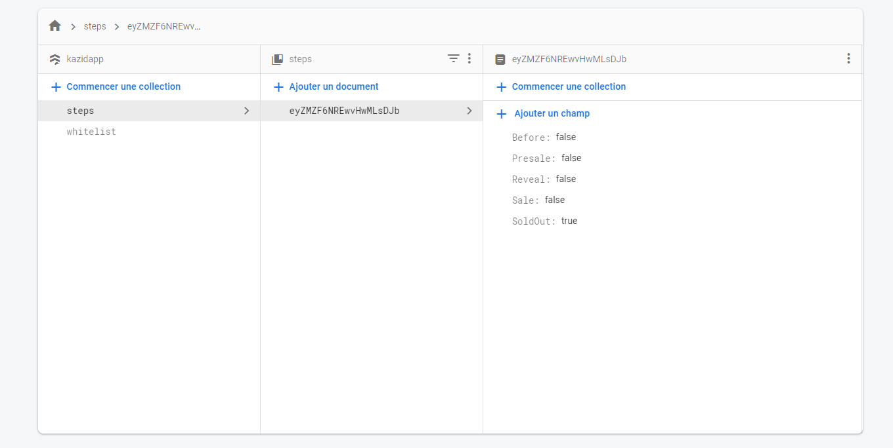
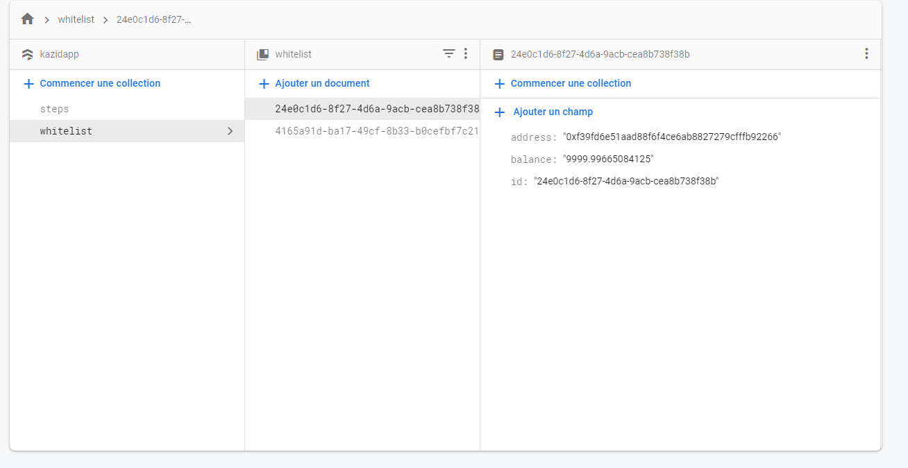
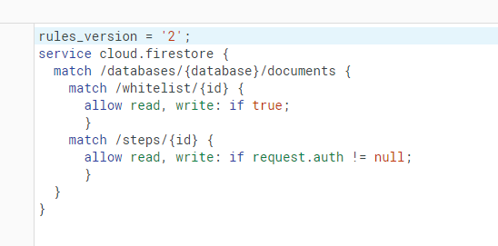

# Hello,

This is my first React dApp serverless to mint NFT (jpeg projects) on ETH, I'm beginner in react

The project got boring for me

I use firebase for Authentication and store datas,

## Some infos

- I used react-app-rewired cuz i need buffer to generate a merkle tree when we update the whitelist on contract
- Working with firebase but u can create ur own API and auth system
- Tailwind <3

## Basic setup

The dApp interact with a contract already deployed, so u need to put the json of contract on /contracts and import him where u want. After just set the address of contract in contract.js

if you use firebase like me, don't forget to update firebase.js with your datas, create a file .env.local and set ur firebase api key "REACT_APP_FIREBASE_API_KEY=XXXXX"

Dont forget to update some function who interact with contract with the ETH mainnet and your contracts functions

**Auth and steps of contract are set in global context**

### Auth :

Working with Firebase Auth system.

When submit form in login page if its successfully we set the user in context and now you can access to the private route /admin

### Steps :
step are recovered when you load App.js, and changed when you update the contract or set "soldout" in admin panel.

According to current step of context the buttons on page change so you dont need to update the website on the server

this is of what my steps collection look like :

### Whitelist :

If the current Step of contract is se to "Before" (when new user can be whitelisted) an user can click on the button in whitelist page and its juste create a new document on the whitelist collection in firebase

example :

### Firebase Rules :

My firebase rules (first time, do it better plz)

# To do :

- Premint function
- Limite access to page Whitelist/Premint/Mint when its the current step
- Better design

## Improve :

- Limite by IPs when writing in whitelist collection
- The are no "COUNT" in firebase, so when an user load whitelist page we count one by one all address whitelisted, its actually not scalable , so find a better way than count one by one whitelisted addresses
- Refactor somes functions
